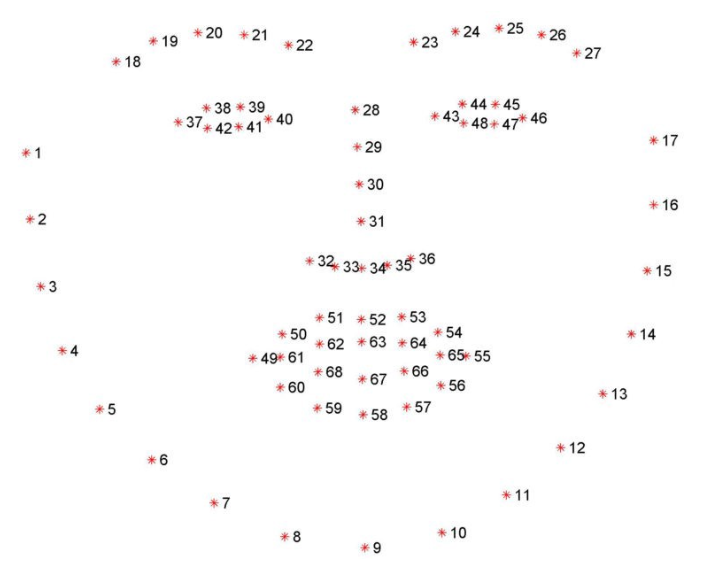

# Yawn-Detector-and-Counter

## Problem Statement
To detect if an object(person) is yawning and to count the number of times yawning is made.

## Main Ideas
Below are some of the main ideas to solve this perticular problem.

1. First step is to detect the facial landmark points on each images using **shape_predictor_68_face_landmarks.dat**. It's a pre-trained facial landmarks detector model. It is used to estimate the location of 68 coordinates (x, y) that map the facial points on a person’s face like image below.

2. Get the landmarks(i.e., x,y co-ordinates) of upper lip and lower lip.

3. Calculate the mean (x,y) co-ordinates of upper lip and lower lip.

4. Calculate the `distance` between the lips and compare the `distance` with some `threshold` value say **25**.

5. **If the `distance` is greater than the `threshold`, then yawning is made**.

6. Further added a functionality to count the number of times yawning is made.
